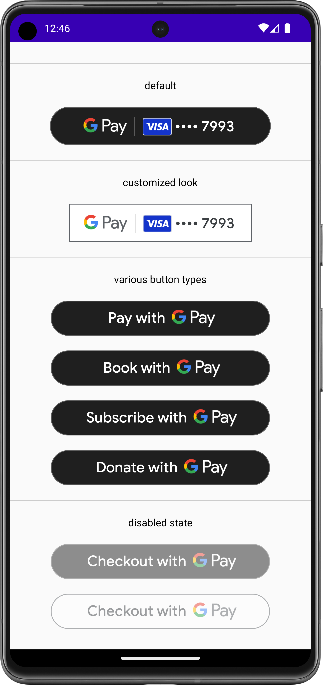

# Google Pay button for Jetpack Compose

[](https://search.maven.org/search?q=g:com.google.pay.button)

An Android library that provides a [Jetpack Compose](https://developer.android.com/jetpack/compose) wrapper on top of the
[Google Pay Button API](https://developers.google.com/pay/api/android/guides/tutorial).

<p align="center">
    
</p>

## Installation

The library is hosted on Maven central and can be used by ensuring the following lines exist in each gradle file:

**build.gradle:**

```groovy
repositories {
    mavenCentral()
}
```

**app/build.gradle:**

```
dependencies {
    implementation "com.google.pay.button:compose-pay-button:<version>"
}
```

## Usage

```kotlin
// other imports omitted for brevity
// see full example in the "app" directory

import com.google.pay.button.ButtonTheme
import com.google.pay.button.ButtonType
import com.google.pay.button.PayButton

class MainActivity : ComponentActivity() {
    override fun onCreate(savedInstanceState: Bundle?) {
        super.onCreate(savedInstanceState)

        val onClick = { println("Button clicked") }

        // as per https://developers.google.com/pay/api/android/reference/request-objects#PaymentMethod
        val allowedPaymentMethods = """
            [
              {
                "type": "CARD",
                "parameters": {
                  "allowedAuthMethods": ["PAN_ONLY", "CRYPTOGRAM_3DS"],
                  "allowedCardNetworks": ["AMEX", "DISCOVER", "JCB", "MASTERCARD", "VISA"]
                },
                "tokenizationSpecification": {
                  "type": "PAYMENT_GATEWAY",
                  "parameters": {
                    "gateway": "example",
                    "gatewayMerchantId": "exampleGatewayMerchantId"
                  }
                }
              }
            ]
        """.trimIndent()

        setContent {
            // Default
            PayButton(onClick = onClick, allowedPaymentMethods = allowedPaymentMethods)

            // Customized look
            PayButton(
                onClick = onClick,
                allowedPaymentMethods = allowedPaymentMethods,
                radius = 1.dp,
                modifier = Modifier.width(200.dp),
                theme = ButtonTheme.Light
            )

            // Customized labels
            PayButton(onClick = onClick, allowedPaymentMethods = allowedPaymentMethods, type = ButtonType.Book)
            PayButton(onClick = onClick, allowedPaymentMethods = allowedPaymentMethods, type = ButtonType.Subscribe)
            PayButton(onClick = onClick, allowedPaymentMethods = allowedPaymentMethods, type = ButtonType.Donate)
        }
    }
}
```

## Error handling and Fallback UI

The `PayButton` composable wraps the underlying `PayButton` Android View, which may encounter errors during initialization. To handle these situations, the `PayButton` composable provides:

*   **`onError` Callback:** Invoked when an error occurs during the button's initialization. This callback receives the `Throwable` that caused the error, allowing you to log it or take other actions.
*   **`fallbackUi` Composable:** An optional composable function that is displayed in place of the button if an error occurs. If not provided, nothing will be displayed in case of error.

This mechanism ensures that your app can gracefully handle potential issues with the `PayButton` and provide a fallback experience to the user.
